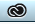
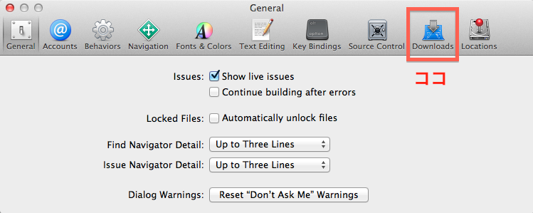

# フロント開発環境の構築手順
5/12(月)からフロント開発が始まるということで、
5/9(金)までにフロント開発に必要な環境を整える必要があります。

Note: 

+ 無線でダウンロードすると遅かったりするので、**できれば有線**でネットにつないでからダウンロードなどをしてください。
+ ここに記されていることはババが環境の構築で行ったことなので、
**もしかしたらバージョンや挙動が異なっている場合があります。**
各チームのSilverの人が手順など知っているので、
疑問や質問がある場合は、最寄りのSilverに伝えてください。
+ 間違いやおかしいとこがあったらissueたてて連絡ください。

## やること
今回やることは大きく分けて以下の３つです。

+ Adobe関連（Photoshop, Illustrator, Flash）のインストール or アップデート
+ Xcode関連（Command Line Tools, iOS Simulator）のインストール
+ Sublime Text 2 のインストール

## Adobe関連
会社PCには最初からAdobe関連のソフトウェアがインストールされています。（されてない人はインストールしてください（丸投げ））
ただし、ライセンスが切れているようなので、それぞれに**配布されたシリアル番号**を使って、3ヶ月延長させることが目的です。

1. シリアル番号が書かれたカードを手に入れる（チームのSilverの人から
2. http://www.creativecloud.com/redeem にアクセスする。
3. Adobe ID 以下の点に気をつけて作る。
	+ 会社のメールアドレスで。
	+ シリアル番号を入力するとき、数字のゼロ（中に斜めの線がある）とアルファベットのオー（中に斜めの線がない）に注意する
	+ **「メンバーシップを自動更新する」**は**「後で通知」**を選ぶ。
4. **Adobe Creative Cloud** を起動する。たぶん何も起動されない。上のメニューバーにある無限っぽいマーク（これ⇒  ）をクリックするとなんか出てくる。
5. そこにも登録したIDとパスワードを入力する
6. **Photoshop, Illustrator, Flash**をアップデートする。
7. 自分のPCに入っている**Photoshop, Illustrator, Flash**を起動して、無事に起動することを確認。

以上でAdobe関連は完了です。

## Xcode関連

会社PCには最初からXcodeがインストールされています。（されてない人はインストールしてください（丸投げ））
そのXcodeからCommand Line ToolsとiOS Simulatorをダウンロードします。

1. Xcodeを立ち上げる（起動しても何もしない）
2. メニューバーから「Xcode」→「Preferences」で設定ウィンドウが開かれます。
3. 設定ウィンドウの上部にある「Downloads」をクリックする。
	
4. 「Command Line Tools」の右側の下矢印マークをクリックしてダウンロード。
5. 「iOS 7.0 Simulator」の右側の下矢印マークをクリックしてダウンロード。

とりあえず以上で大丈夫だと思います。（使い方などは来週やるんじゃないでしょーか

## Sublime Text 2

最後にSublime Text 2をダウンロードしてインストールしてください。

1. http://www.sublimetext.com/2 にアクセスする
2. 「OS X (OS X 10.6 or later is required)」と書いてあるところをクリック。（ダウンロードスタート）
3. 「Sublime Text 2.0.2.dmg」がダウンロード完了したらダブルクリックしてインストールする。

とりあえず以上で動くと思います。（使い方などは来週や(ry

